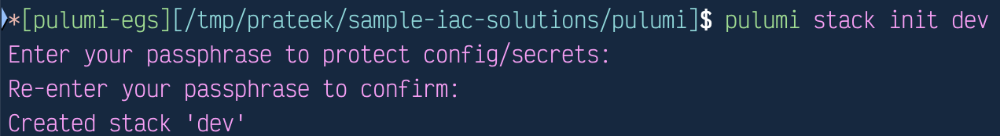
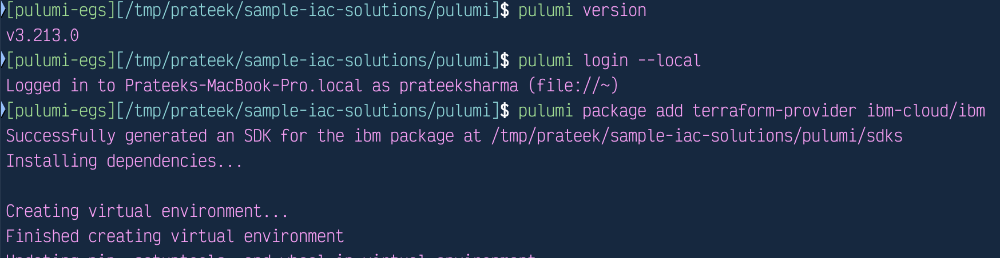
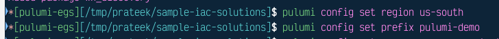
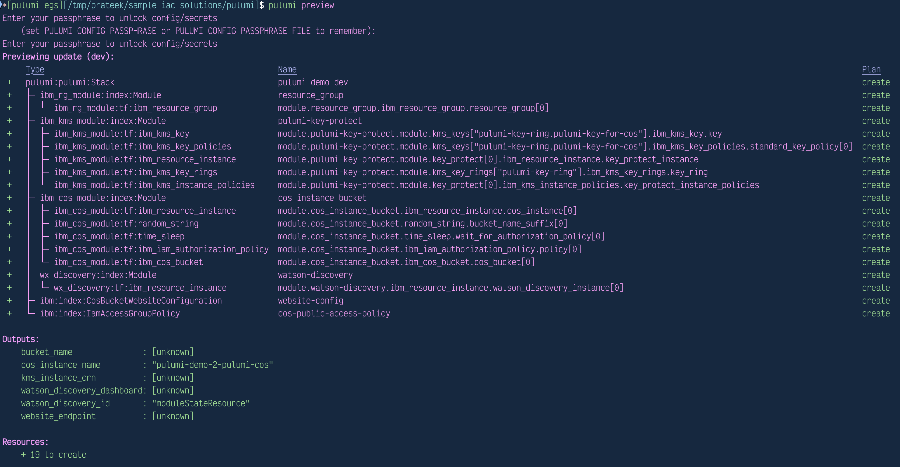

# Description

This Pulumi example will demonstrate how to provision Resource Group, Key Protect, Object Storage and Watson Discovery instances using Terraform IBM Modules.

## Prerequisites

Before you begin, ensure you have:

a) [Pulumi CLI](https://www.pulumi.com/docs/get-started/download-install/) installed

b) [IBM Cloud CLI](https://cloud.ibm.com/docs/cli) installed and configured (optional)

c) An [IBM Cloud API key](https://cloud.ibm.com/docs/account?topic=account-userapikey)

d) [Git](https://git-scm.com/install/) installed

## Steps

**1. Clone the repository**

```sh
git clone https://github.com/terraform-ibm-modules/sample-iac-solutions.git
cd sample-iac-solutions/pulumi-egs/pulumi
```

**2. Log in to Pulumi (either you can create an account in Pulumi or use local-only mode).**

```sh
pulumi login --local
```

**3. Create new Pulumi Stack**

Provide the Stack details and Passphrase to be used


```sh
pulumi stack init dev # dev is name of the new stack created.
```



**4. Install dependencies**

Add pulumi IBM provider package and Terraform modules to the project :

```sh
pulumi package add terraform-provider ibm-cloud/ibm
pulumi package add terraform-module terraform-ibm-modules/cos/ibm 10.7.2 ibm_cos_module
pulumi package add terraform-module terraform-ibm-modules/kms-all-inclusive/ibm 5.5.5 ibm_kms_module
pulumi package add terraform-module terraform-ibm-modules/resource-group/ibm 1.4.6 ibm_rg_module
pulumi package add terraform-module terraform-ibm-modules/watsonx-discovery/ibm 1.11.1 wx_discovery
```



**5. Configure IBM Cloud credentials**

Export your API key:

```sh
export IBMCLOUD_API_KEY=<your_ibmcloud_api_key> # pragma: allowlist secret
```

**6. Set Pulumi stack config**

If required to change the default values, define region, prefix, resource group and access group:

```sh
pulumi config set region us-south # Provide region
pulumi config set prefix pulumi-demo # Provide the prefix
pulumi config set resource-group Default # Replace with Resource Group of your choice.
pulumi config set access_group "Public Access" # Replace with Access group of your choice. Make sure the provided Access Group exists in IBMCloud account.
```



**7. Preview the changes**

```sh
pulumi preview
```



**8. Apply the changes**

```sh
pulumi up
```

**9. Destroy the resources**

```sh
pulumi down
```

## Validation

After deployment, verify that resources were provisioned successfully:

- Pulumi Console Output – Confirm resource creation summary.
- Login to IBM Cloud Console and verify –
  - COS instance and bucket under Object Storage
  - Watson Discovery instance in the dashboard
  - Resource Group and Key Protect instance under Resource List
