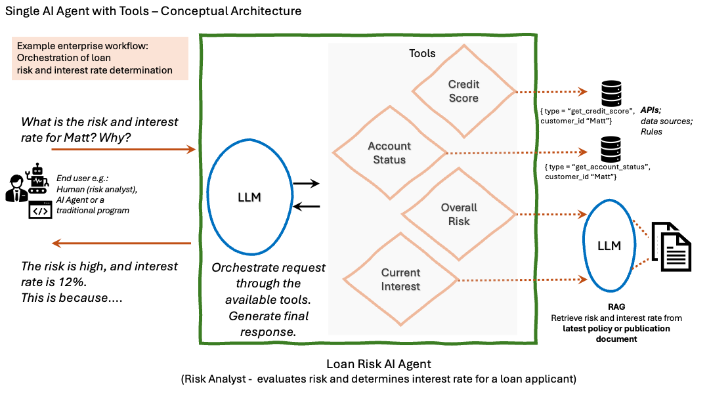
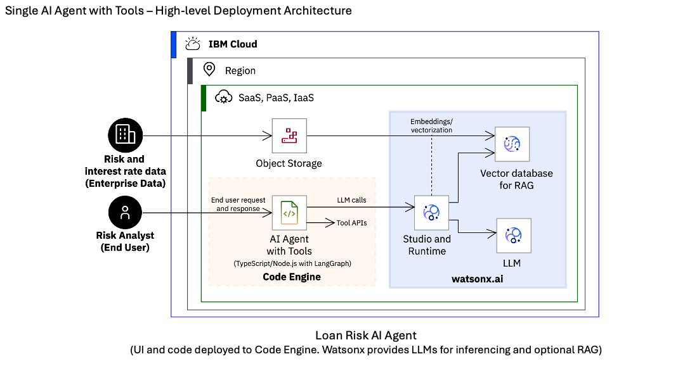

# Loan Risk AI Agent - Architecture

## Overview

This application demonstrates agentic AI for bank loan risk evaluation using a Single AI Agent with Tools architecture pattern.

## Architecture

The application implements an autonomous AI agent that evaluates loan risk by intelligently selecting and chaining tools to gather information and make decisions.

### Core Components

1. **Web Interface** - Express.js application serving user interface and REST API
2. **AI Agent** - LangGraph-based agent orchestrating the workflow
3. **LLM** - IBM watsonx.ai Granite model for reasoning and decision-making
4. **Tools** - Four functions for retrieving credit scores, account status, calculating risk, and determining interest rates

### How It Works

The agent receives a natural language query and autonomously:
- Analyzes what information is needed
- Selects appropriate tools in logical sequence
- Executes tools (e.g., credit score → account status → risk calculation → interest rate)
- Synthesizes results into a coherent response

This demonstrates **agentic AI** - the LLM reasons about what actions to take rather than following predefined rules.

### Technology Stack

- **Runtime**: TypeScript/Node.js
- **AI Framework**: LangGraph
- **LLM**: IBM watsonx.ai (ibm/granite-4-h-small)
- **Deployment**: Docker on IBM Cloud Code Engine

### Optional Enhancements

- **RAG Integration**: Tools can query watsonx.ai RAG endpoints with policy documents for enhanced responses
- **Chat Interface**: watsonx Assistant integration for conversational experience

## Deployment Architecture

The application runs as a containerized service on IBM Cloud Code Engine, integrating with watsonx.ai for LLM inference and optional watsonx Assistant for chat capabilities.

## Key Features

- Autonomous tool selection by LLM
- Sequential reasoning with context retention
- Stateless, scalable design
- Secure IAM authentication

## See also

- [Agentic AI Article](https://developer.ibm.com/articles/agentic-ai-workflow-automation/)
- [Demo Video](https://mediacenter.ibm.com/media/Agentic+AI+on+IBM+Cloud+-+Demo+Video/1_kn6kvqmz)
